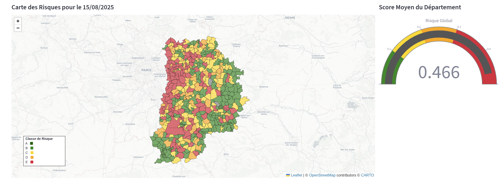

# 🚀 Jedha Lead



## Project Architecture 🏗️

The project is composed of several integrated components:

- **Airflow**: Orchestrates ETL and ML training workflows. DAGs automate data ingestion, transformation, and model training. Airflow loads secrets and connections from JSON/config files and environment variables.
  - ETL DAG: Fetches accident, weather, holidays, and meta data, processes and uploads to S3, then loads into Snowflake.
  - ML Training DAG: Launches EC2 instances, polls Jenkins, runs ML training, and manages model deployment.
- **S3**: Stores raw and processed CSV data files for ingestion and training.
- **Snowflake**: Serves as the data warehouse, ingesting processed CSVs from S3 for analytics and ML.
- **MLflow**: Tracks experiments, models, and metrics. Integrated with Airflow and EC2 for training and deployment.
- **API**: Exposes model predictions and data endpoints. Built with FastAPI and deployed via Docker.
- **Jenkins**: (Optional) Triggers ML training jobs and CI/CD pipelines.

**Data Flow:**

1. Airflow DAGs fetch and process data, saving results to S3.
2. Airflow loads processed CSVs from S3 into Snowflake using the S3ToSnowflakeOperator.
3. ML training DAG launches EC2, runs training scripts, and logs results to MLflow.
4. API serves predictions using trained models and data from Snowflake.

**Configuration:**

- Secrets and connection info are managed via Airflow Variables and Connections (JSON/config import).
- Docker Compose orchestrates all services for local development.

**Diagram (Textual):**

```
        [External Data Sources]
                 |
                 v
         [Airflow DAGs]
                 |
                 v
         [S3] <--> [Snowflake]
                 |
                 v
         [ML Training (EC2, MLflow)]
                 |
                 v
         [FRONT (STREAMLIT)]
```

## Airflow Configuration 🔐

### Installation & Setup 🚀

1. Add AIRFLOW_UID env variable in .env file.

```bash
cd airflow
echo -e "AIRFLOW_UID=$(id -u)" > .env
```

2. Start the Airflow services:

```bash
docker compose up airflow-init
docker-compose up -d --build
```

4. Access Airflow web interface:

````
http://localhost:8080
Username: airflow
Password: airflow

## Requirements

- docker
- poetry

## Links to services

mlflow : [mlflow](https://huggingface.co/spaces/littlerobinson/mlflow)

## Deployment

### MLFlow

To deploy the MLFlow project:

```bash
cd mlflow

# Create local python environment
poetry install

# Build docker image
docker build . mlflow_image_name

# Deploy images on your server
````

#### Variables

Set the following variables in the Airflow Admin Interface (Admin > Variables):

```
AWS_DEFAULT_REGION    # Your AWS region (e.g., eu-west-1)
WEATHERMAP_API        # Your WeatherMap API key
S3BucketName          # Your S3 bucket name
```

### Connections

Configure the following connections in Airflow (Admin > Connections):

1. AWS Connection (`aws_id`):

   - Conn Type: Amazon Web Services
   - Configure with your AWS credentials

2. Snowflake Connection (`snowflake_id`):
   - Conn Type: Snowflake
   - Configure with your database credentials

## SNOWFLAKE

### Database structure

```sql
USE ROLE ACCOUNTADMIN;

CREATE OR REPLACE role BOT_ROLE;

CREATE OR REPLACE USER BOT_USER
  PASSWORD = 'xxx'
  DEFAULT_ROLE = bot_role
  DEFAULT_WAREHOUSE = COMPUTE_WH
  MUST_CHANGE_PASSWORD = FALSE;

GRANT CREATE DATABASE ON ACCOUNT TO ROLE BOT_ROLE;

CREATE OR REPLACE DATABASE rescue_predict_db;

ALTER USER BOT_USER SET TYPE = LEGACY_SERVICE;
ALTER USER BOT_USER SET DEFAULT_WAREHOUSE = 'COMPUTE_WH';

GRANT USAGE ON DATABASE rescue_predict_db TO ROLE BOT_ROLE;
GRANT USAGE ON SCHEMA rescue_predict_db.public TO ROLE BOT_ROLE;
GRANT CREATE TABLE ON SCHEMA rescue_predict_db.public TO ROLE BOT_ROLE;
GRANT SELECT, INSERT, UPDATE, DELETE ON FUTURE TABLES IN SCHEMA rescue_predict_db.public TO ROLE BOT_ROLE;

CREATE TABLE IF NOT EXISTS RESCUE_PREDICT_DB.PUBLIC."accidents" (
    "com" NUMBER(38,0),
    "population" NUMBER(38,0),
    "jour" NUMBER(38,0),
    "mois" NUMBER(38,0),
    "an" NUMBER(38,0),
    "public_holidays" BOOLEAN,
    "zone_a" BOOLEAN,
    "zone_b" BOOLEAN,
    "zone_c" BOOLEAN,
    "dep" NUMBER(38,0),
    "nombre_d_accidents" NUMBER(38,0) DEFAULT NULL,
    "date" VARCHAR(16777216),
    "temp" FLOAT,
    "feels_like" FLOAT,
    "temp_min" FLOAT,
    "temp_max" FLOAT,
    "pressure" FLOAT,
    "humidity" FLOAT,
    "wind_speed" FLOAT,
    "clouds_all" FLOAT,
    "execution_date" VARCHAR(16777216),
    "dag_id" VARCHAR(16777216),
    "task_id" VARCHAR(16777216)
);

ALTER TABLE RESCUE_PREDICT_DB.PUBLIC."accidents"
ADD CONSTRAINT uniq_value
UNIQUE ("com", "jour", "mois", "an");

CREATE TABLE IF NOT EXISTS RESCUE_PREDICT_DB.PUBLIC."accidents_predict" (
    "com" NUMBER(38,0),
    "population" NUMBER(38,0),
    "jour" NUMBER(38,0),
    "mois" NUMBER(38,0),
    "an" NUMBER(38,0),
    "public_holidays" BOOLEAN,
    "zone_a" BOOLEAN,
    "zone_b" BOOLEAN,
    "zone_c" BOOLEAN,
    "dep" NUMBER(38,0),
    "date" VARCHAR(16777216),
    "temp" FLOAT,
    "feels_like" FLOAT,
    "temp_min" FLOAT,
    "temp_max" FLOAT,
    "pressure" FLOAT,
    "humidity" FLOAT,
    "wind_speed" FLOAT,
    "clouds_all" FLOAT,
    "prediction_score" FLOAT,
    "execution_date" VARCHAR(16777216),
    "dag_id" VARCHAR(16777216),
    "task_id" VARCHAR(16777216)
);

ALTER TABLE RESCUE_PREDICT_DB.PUBLIC."accidents_predict"
ADD CONSTRAINT
UNIQUE ("com", "jour", "mois", "an") ENFORCED;

GRANT ROLE BOT_ROLE TO USER BOT_USER;

USE ROLE ACCOUNTADMIN;

GRANT USAGE ON WAREHOUSE COMPUTE_WH TO ROLE BOT_ROLE;

ALTER USER BOT_USER SET DEFAULT_WAREHOUSE = 'COMPUTE_WH';

SHOW USERS LIKE 'BOT_USER';

```

## Streamlit

### Installation & Setup 🚀

```bash
cd streamlit
docker compose build
docker compose up -d
```

open http://0.0.0.0:7860 and enjoy ! 🚀
